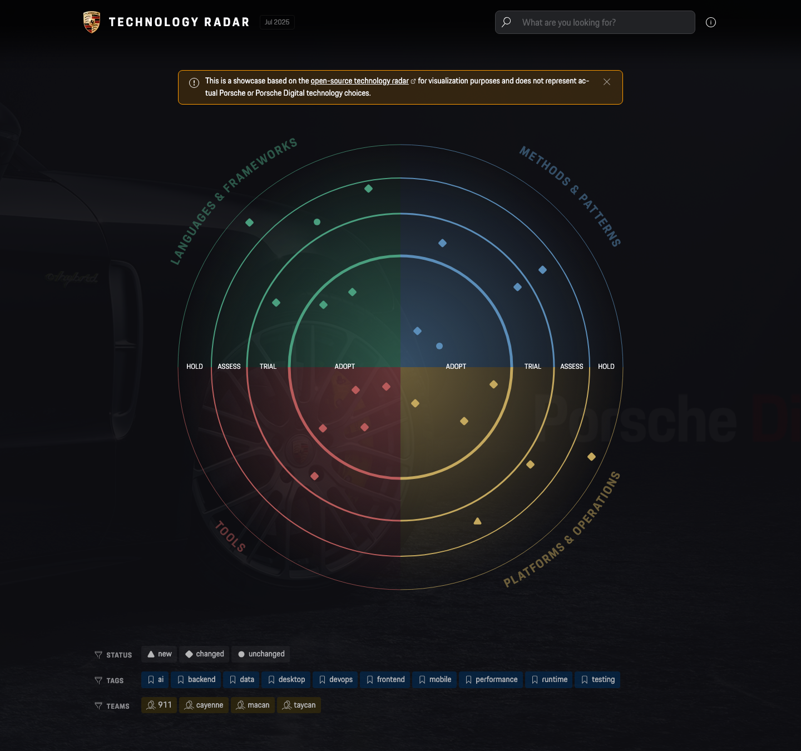
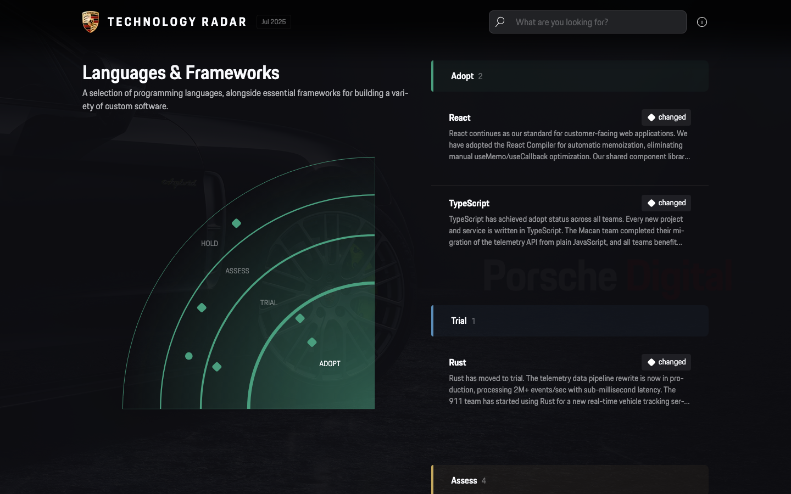
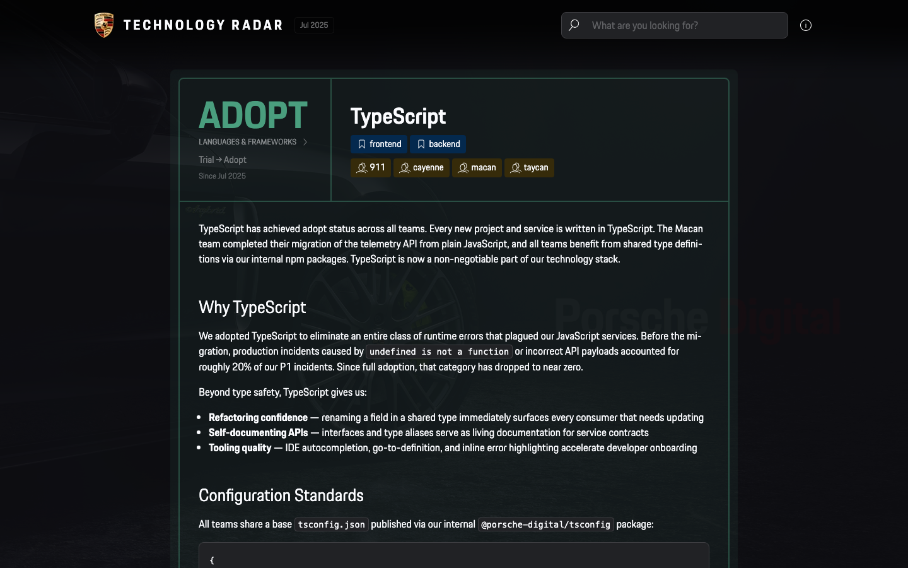
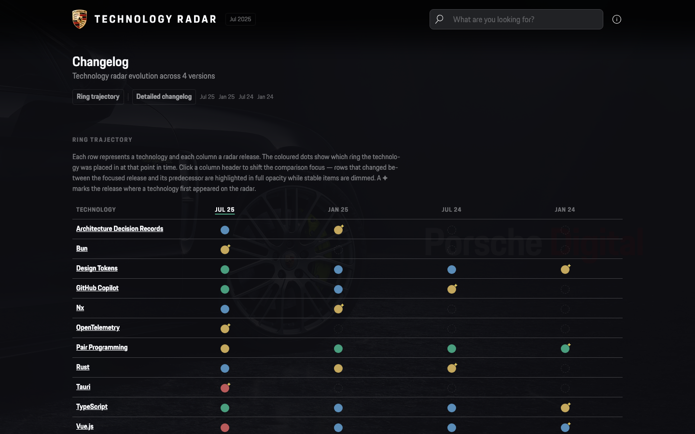
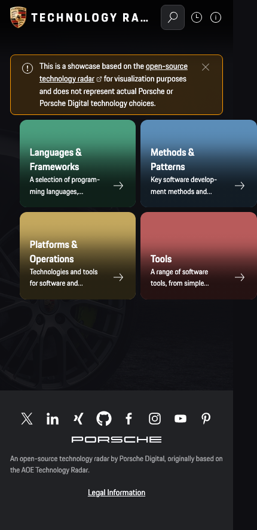

# Porsche Digital Technology Radar

[](https://github.com/porscheofficial/porschedigital-technology-radar/actions/workflows/deploy.yml)
[](https://www.npmjs.com/package/@porscheofficial/porschedigital-technology-radar)
[](https://www.npmjs.com/package/@porscheofficial/porschedigital-technology-radar)
[](https://github.com/porscheofficial/porschedigital-technology-radar/releases)
[](./LICENSE)
[](https://www.typescriptlang.org/)
[](https://biomejs.dev/)
[](https://github.com/porscheofficial/porschedigital-technology-radar/stargazers)
[](https://github.com/porscheofficial/porschedigital-technology-radar/commits/pdig)

A static site generator for building and publishing your own Technology Radar.

**[🔗 Live Showcase](https://opensource.porsche.com/porschedigital-technology-radar/)**



## Table of Contents

<p align="center">
  <a href="#-about">About</a> ·
  <a href="#-why-a-technology-radar">Why a Technology Radar?</a> ·
  <a href="#-features">Features</a> ·
  <a href="#-screenshots">Screenshots</a> ·
  <a href="#-quick-start">Quick Start</a> ·
  <a href="#-project-structure-consumer">Project Structure</a> ·
  <a href="#️-configuration">Configuration</a> ·
  <a href="#-radar-items">Radar Items</a> ·
  <a href="#️-development-contributing-to-the-generator">Development</a> ·
  <a href="#-custom-styling">Custom Styling</a> ·
  <a href="#-license">License</a>
</p>

## 📖 About

This project is maintained by **Porsche Digital** and is based on the open-source [AOE Technology Radar](https://github.com/AOEpeople/aoe_technology_radar). The codebase has been substantially rewritten and extended — it is not a drop-in replacement.

> [!NOTE]
> Your existing radar items (Markdown files) can be reused as-is, but the configuration needs to be updated to match the new schema.

## 💡 Why a Technology Radar?

A Technology Radar makes technology decisions visible across your organization. It gives CTOs, architects, and tech leads a shared vocabulary for evaluating, adopting, and retiring technologies — and keeps engineering teams aligned on what to invest in.

## ✨ Features

- **Visual technology landscape** — See your entire technology portfolio at a glance, organized by quadrant and maturity ring
- **Track decisions over time** — Full revision history per technology and a trajectory view across releases, so you can see how assessments evolved
- **Team visibility** — Understand which teams use which technologies, enabling informed staffing and knowledge-sharing decisions
- **Searchable and filterable** — Find technologies instantly by name, tag, team, or status with real-time highlighting across the radar. Supports configurable multi-select or single-select filtering with shareable filter URLs
- **Your branding, your rules** — Fully customizable colors, logos, quadrants, rings, and labels via a single `config.json`
- **Zero infrastructure** — Static site that deploys to GitHub Pages, Netlify, or any hosting. No servers, no databases, no runtime dependencies
- **Content as code** — Technologies are plain Markdown files in Git. Review changes in PRs, track history with commits, collaborate with your existing workflow

## 📸 Screenshots

### Quadrant Detail

Drill into a single quadrant with a zoomed mini-radar and a grouped technology list.



### Technology Detail

Each technology has its own page with ring status, description, tags, teams, and full revision history.



### History & Changelog

Track how technology assessments evolved across releases with the trajectory matrix.



### Mobile

Fully responsive — works on phones and tablets out of the box.

<p align="center">
  
</p>

## 🚀 Quick Start

> [!IMPORTANT]
> **Prerequisites:** Node.js 22+

### 1. Create a new project

```bash
mkdir my-technology-radar && cd my-technology-radar
npm init -y
```

### 2. Install the radar as a dependency

```bash
npm install @porscheofficial/porschedigital-technology-radar
```

### 3. Initialize the project

Scaffolds starter files (`radar/`, `config.json`, `about.md`, `public/`, `custom.scss`, `.gitignore`) into your directory:

```bash
npx techradar init
```

### 4. Customize

Edit the scaffolded files to match your organization:

- `config.json` — branding, quadrants, rings, colors (see [Configuration](#configuration))
- `radar/` — your technology items as Markdown (see [Radar Items](#radar-items))
- `about.md` — content for the help & about page
- `public/` — favicon, images, background image
- `custom.scss` — optional style overrides

### 5. Run

```bash
npx techradar dev     # Start dev server with file watching
npx techradar build   # Build static site → build/
npx techradar serve   # Start dev server without file watching
```

### 6. Deploy

After `npx techradar build`, the static site is in `build/`. Deploy it to GitHub Pages, Vercel, Netlify, or any static hosting provider.

## 📁 Project Structure (consumer)

```
my-technology-radar/
├── config.json          # Your configuration overrides
├── about.md             # Content for the help & about page
├── custom.scss          # Optional style overrides
├── public/
│   ├── favicon.ico      # Your favicon
│   └── images/          # Images referenced in radar items
├── radar/
│   ├── 2024-06-01/
│   │   ├── react.md
│   │   └── kubernetes.md
│   └── 2025-01-15/
│       ├── react.md     # Updated entry overwrites previous
│       └── deno.md
├── build/               # Generated static site (after build)
├── .techradar/          # Shadow build dir (auto-generated)
└── .gitignore           # Auto-generated with .techradar/, build/, node_modules/
```

The CLI automatically creates a `.gitignore` (or extends your existing one) with the entries needed to keep generated directories out of version control.

> [!TIP]
> Only `config.json`, `about.md`, `custom.scss`, `public/`, and `radar/` need your attention. Everything else is managed by the CLI.

## ⚙️ Configuration

All configuration lives in `data/config.json`. Any key you omit falls back to the defaults in `data/config.default.json`. You only need to set what you want to change.

<details>
<summary><strong>Root</strong></summary>

| Key                 | Description                                                                                        | Default |
| ------------------- | -------------------------------------------------------------------------------------------------- | ------- |
| `basePath`          | URL path prefix. Set to `/` for root hosting, or `/techradar` for a sub-path.                      | `/`     |
| `baseUrl`           | Full URL where the radar is hosted. Used for `sitemap.xml`.                                        | `""`    |
| `editUrl`           | If set, shows an edit button on item pages. Supports `{id}` and `{release}` placeholders. Example: `https://github.dev/org/repo/blob/main/data/radar/{release}/{id}.md` | `""`    |
| `headerLogoFile`    | Path to a logo image in `public/` for the header. Leave empty to use the default Porsche crest.    | `""`    |
| `footerLogoFile`    | Path to a logo image in `public/` for the footer. Leave empty to use the default Porsche wordmark. | `""`    |
| `jsFile`            | Path in `public/` or URL to a custom JavaScript file to include on every page.                     | `""`    |
| `backgroundImage`   | Path to an image in `public/` shown as a subtle background overlay. Leave empty to disable.        | `""`    |
| `backgroundOpacity` | Opacity of the background image overlay (0 = invisible, 1 = fully visible).                        | `0.06`  |
| `imprint`           | URL to your legal information / imprint page.                                                      | `""`    |

</details>

<details>
<summary><strong><code>toggles</code></strong></summary>

| Key              | Description                                   | Default |
| ---------------- | --------------------------------------------- | ------- |
| `showSearch`     | Show the search bar in the header.            | `true`  |
| `showChart`      | Show the radar visualization on the homepage. | `true`  |
| `showTagFilter`  | Show the tag filter below the radar.          | `true`  |
| `showTeamFilter` | Show the team filter below the radar.         | `true`  |
| `showDemoDisclaimer` | Show the demo-data disclaimer banner on the homepage. | `false` |
| `multiSelectFilters` | Allow selecting multiple filters per dimension (OR semantics within, AND across). When `false`, each dimension allows only one active filter at a time. | `true` |

</details>

<details>
<summary><strong><code>colors</code></strong></summary>

A map of CSS color values that theme the entire radar.

| Key          | Description                          | Default   |
| ------------ | ------------------------------------ | --------- |
| `foreground` | Primary text and UI element color    | `#FBFCFF` |
| `background` | Page background                      | `#0E0E12` |
| `highlight`  | Highlighted text and active elements | `#FBFCFF` |
| `content`    | Secondary content text               | `#AFB0B3` |
| `text`       | Tertiary / muted text                | `#88898C` |
| `link`       | Link color                           | `#FBFCFF` |
| `border`     | Border and separator color           | `#404044` |
| `tag`        | Tag background color                 | `#404044` |

</details>

<details>
<summary><strong><code>quadrants</code></strong></summary>

An array of exactly 4 quadrant objects.

| Key           | Description                                      |
| ------------- | ------------------------------------------------ |
| `id`          | Identifier used in radar Markdown files and URLs |
| `title`       | Display title of the quadrant                    |
| `description` | Shown on the homepage and quadrant detail page   |
| `color`       | CSS color for the quadrant arc and its blips     |

</details>

<details>
<summary><strong><code>rings</code></strong></summary>

An array of ring objects (typically 4), ordered from innermost to outermost.

| Key           | Description                                                    |
| ------------- | -------------------------------------------------------------- |
| `id`          | Identifier used in radar Markdown files                        |
| `title`       | Display title, shown as badge label                            |
| `description` | Optional description text                                      |
| `color`       | CSS color for the ring badge                                   |
| `radius`      | Outer boundary of the ring as a fraction of the chart (0 to 1) |
| `strokeWidth` | Thickness of the ring's arc border in the SVG                  |

</details>

<details>
<summary><strong><code>flags</code></strong></summary>

Flags mark items as `new`, `changed`, or `default` (unchanged). Each flag has a single key:

| Key     | Description                                                     |
| ------- | --------------------------------------------------------------- |
| `title` | Display label for the flag (e.g. "New", "Changed", "Unchanged") |

</details>

<details>
<summary><strong><code>chart</code></strong></summary>

| Key        | Description                                                              | Default |
| ---------- | ------------------------------------------------------------------------ | ------- |
| `size`     | Base size of the radar chart in pixels. Increase if you have many items. | `800`   |
| `blipSize` | Radius of each blip dot in pixels                                        | `12`    |

</details>

<details>
<summary><strong><code>social</code></strong></summary>

An array of social link objects shown in the footer.

| Key    | Description                                                                                                        |
| ------ | ------------------------------------------------------------------------------------------------------------------ |
| `href` | URL to the social profile                                                                                          |
| `icon` | Icon name. Available: `x`, `linkedin`, `facebook`, `instagram`, `youtube`, `xing`, `pinterest`, `github`, `gitlab` |

</details>

<details>
<summary><strong><code>labels</code></strong></summary>

| Key                 | Description                                               | Default                                                                                             |
| ------------------- | --------------------------------------------------------- | --------------------------------------------------------------------------------------------------- |
| `title`             | Radar title shown in the header and page titles           | `"Technology Radar"`                                                                                |
| `imprint`           | Label for the imprint link in the footer                  | `"Legal Information"`                                                                               |
| `footer`            | Text shown in the footer                                  | `"Based on the open-source Technology Radar by AOE GmbH, extensively modified by Porsche Digital."` |
| `notUpdated`        | Warning shown on items not updated in the last 3 releases | `"This item was not updated in last three versions of the Radar."`                                  |
| `hiddenFromRadar`   | Info shown on items hidden from the radar chart           | `"This technology is currently hidden from the radar chart."`                                       |
| `searchPlaceholder` | Placeholder text in the search input                      | `"What are you looking for?"`                                                                       |
| `metaDescription`   | HTML meta description for SEO                             | `""`                                                                                                |

</details>

---

### Full example

<details>
<summary><strong>Complete <code>config.json</code> for a fictional company</strong></summary>

```json
{
  "basePath": "/techradar",
  "baseUrl": "https://techradar.acme.io",
  "editUrl": "https://github.dev/acme/techradar/blob/main/radar/{release}/{id}.md",
  "headerLogoFile": "/images/acme-logo.svg",
  "footerLogoFile": "/images/acme-wordmark.svg",
  "backgroundImage": "/images/bg-pattern.png",
  "backgroundOpacity": 0.04,
  "imprint": "https://acme.io/legal",
  "toggles": {
    "showSearch": true,
    "showChart": true,
    "showTagFilter": true,
    "showTeamFilter": false,
    "multiSelectFilters": true
  },
  "colors": {
    "foreground": "#F0F0F5",
    "background": "#1A1A2E",
    "highlight": "#E94560",
    "content": "#A0A0B0",
    "text": "#707080",
    "link": "#E94560",
    "border": "#2A2A40",
    "tag": "#2A2A40"
  },
  "quadrants": [
    {
      "id": "languages-and-frameworks",
      "title": "Languages & Frameworks",
      "description": "Programming languages and application frameworks used across our stack.",
      "color": "#0F9D58"
    },
    {
      "id": "infrastructure",
      "title": "Infrastructure",
      "description": "Cloud platforms, orchestration, and infrastructure-as-code tools.",
      "color": "#4285F4"
    },
    {
      "id": "data-and-ai",
      "title": "Data & AI",
      "description": "Data pipelines, storage, analytics, and machine learning frameworks.",
      "color": "#F4B400"
    },
    {
      "id": "developer-experience",
      "title": "Developer Experience",
      "description": "Tools and practices that improve developer productivity and satisfaction.",
      "color": "#DB4437"
    }
  ],
  "rings": [
    {
      "id": "adopt",
      "title": "Adopt",
      "description": "Proven in production. Use by default for new projects.",
      "color": "#0F9D58",
      "radius": 0.5,
      "strokeWidth": 5
    },
    {
      "id": "trial",
      "title": "Trial",
      "description": "Worth pursuing. Use in non-critical projects to build experience.",
      "color": "#4285F4",
      "radius": 0.69,
      "strokeWidth": 3
    },
    {
      "id": "assess",
      "title": "Assess",
      "description": "Interesting. Explore in spikes or proof-of-concepts.",
      "color": "#F4B400",
      "radius": 0.85,
      "strokeWidth": 2
    },
    {
      "id": "hold",
      "title": "Hold",
      "description": "Do not start new work with this. Migrate away when practical.",
      "color": "#DB4437",
      "radius": 1,
      "strokeWidth": 0.75
    }
  ],
  "flags": {
    "new": { "title": "New" },
    "changed": { "title": "Changed" },
    "default": { "title": "Unchanged" }
  },
  "chart": {
    "size": 900,
    "blipSize": 14
  },
  "social": [
    { "href": "https://github.com/acme", "icon": "github" },
    { "href": "https://linkedin.com/company/acme", "icon": "linkedin" }
  ],
  "labels": {
    "title": "ACME Tech Radar",
    "imprint": "Legal Notice",
    "footer": "Built with the Porsche Digital Technology Radar.",
    "notUpdated": "This item has not been reviewed in the last three releases.",
    "hiddenFromRadar": "This technology is hidden from the radar chart.",
    "searchPlaceholder": "Search technologies…",
    "metaDescription": "ACME's technology radar — tracking what we adopt, trial, assess, and hold."
  }
}
```

</details>

## 📝 Radar Items

Radar items are Markdown files organized by release date under `radar/`.

```
radar/
├── 2024-06-01/
│   ├── react.md
│   └── kubernetes.md
└── 2025-01-15/
    ├── react.md
    └── deno.md
```

Each file has a YAML front-matter header followed by Markdown content:

```markdown
---
title: "React"
ring: adopt
quadrant: languages-and-frameworks
tags:
  - frontend
  - javascript
teams:
  - web-platform
  - mobile
links:
  - url: https://react.dev
    name: Official Docs
  - url: https://github.com/facebook/react
---

Description of the technology, why it was adopted, and any relevant context.
Supports full **Markdown** formatting.
```

### Front-matter attributes

| Attribute  | Required | Description                                                                                             |
| ---------- | -------- | ------------------------------------------------------------------------------------------------------- |
| `title`    | Yes      | Name of the technology                                                                                  |
| `ring`     | Yes      | Ring placement. Must match one of the `id` values in `config.rings`.                                    |
| `quadrant` | Yes      | Quadrant assignment. Must match one of the `id` values in `config.quadrants`.                           |
| `tags`     | No       | List of tags for filtering.                                                                             |
| `teams`    | No       | List of teams currently using this technology.                                                          |
| `links`    | No       | List of external links. Each entry has a `url` (required) and optional `name`. Shown on the detail page. |
| `featured` | No       | Set to `false` to hide from the radar chart while keeping the item in the overview. Defaults to `true`. |

### Versioning

The filename (without `.md`) serves as the item identifier. When the same filename appears in a newer release folder, the newer entry overwrites the previous one — attributes are merged and a new history entry is created.

### Images

Place images in `public/images/` and reference them in Markdown:

```markdown

```

### Cross-linking blips

Use wiki-link syntax to link between radar items. The build resolves each link to the correct URL based on the item's quadrant:

```markdown
We use [[typescript]] alongside [[react]] for our frontend stack.
See also [[kubernetes|our K8s setup]] for deployment details.
```

| Syntax | Rendered as |
| --- | --- |
| `[[item-id]]` | Link using the item's title as label |
| `[[item-id\|custom label]]` | Link using a custom label |

The `item-id` is the Markdown filename without the `.md` extension (e.g., `typescript.md` → `typescript`).

Unresolved wiki-links (referencing a non-existent item) are rendered as plain text with a build warning.

> [!WARNING]
> In strict mode (`--strict`), unresolved wiki-links cause the build to fail.

## 🛠️ Development (contributing to the generator)

To work on the radar generator itself:

```bash
git clone https://github.com/porscheofficial/porschedigital-technology-radar.git
cd porschedigital-technology-radar
npm install           # Also runs postinstall → build:icons
npm run build:data    # Parse Markdown files into data/data.json
npm run dev           # Start Next.js dev server
```

The build pipeline:

1. `build:icons` — generates React icon components from SVGs in `src/icons/`
2. `build:data` — parses `radar/` Markdown files into `data/data.json` and `data/about.json`
3. `next build` — builds the static site into `out/`

The `npm run build` command runs all three steps in sequence.

### Strict mode

Pass `--strict` to turn warnings into errors during the data build step.

**Consumer projects** (using the CLI):

```bash
npx techradar --strict build
npx techradar --strict dev
```

**This repository** (development):

```bash
npm run build:data -- --strict
```

In strict mode, the build fails on:

- Invalid frontmatter (missing or invalid `ring`, `quadrant`, etc.)
- Unresolved wiki-links (e.g., `[[nonexistent-item]]`)

This is recommended for CI pipelines to catch issues before deployment.

> [!TIP]
> Add `npx techradar --strict build` to your CI pipeline to catch frontmatter issues and broken wiki-links before deployment.

## 🎨 Custom Styling

You can add custom SCSS rules in `custom.scss`.

> [!NOTE]
> The project uses CSS Modules with hashed class names. Use element or attribute selectors to target components.

```scss
/* Example: change headline fonts */
h1,
h2,
h3 {
  font-family: "Times New Roman", Times, serif;
}
```

Changes to `custom.scss` are picked up automatically in `dev` mode (with file watching).

## 📄 License

This project is open source under the [Apache License 2.0](./LICENSE).

Originally based on the [AOE Technology Radar](https://github.com/AOEpeople/aoe_technology_radar).
Maintained and developed by [Porsche Digital](https://www.porsche.digital/).
