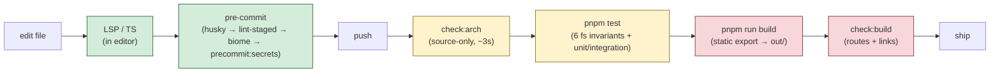
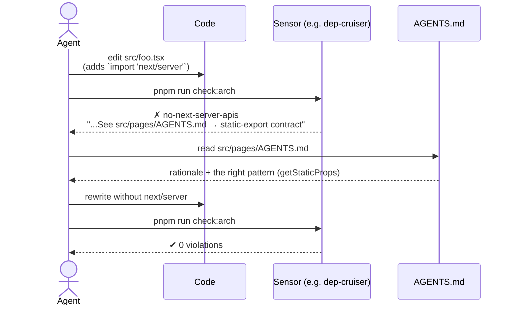

# Harness Engineering — Worked Example

> **Keep in sync.** This file is a teaching artifact built from the real harness in this repo. Any change to a sensor, a rule, an `AGENTS.md`, or a `pnpm run check:*` script MUST be reflected here in the same PR. Out-of-date diagrams teach the wrong lesson. (See root `AGENTS.md` → _Harness Documentation Sync_.)

This document explains what a coding-agent harness is, then walks through the one wired into this project — concretely, with file paths and rule names you can grep for.

---

## 1. What is a harness?

A **harness** is the set of guides and sensors that surrounds a coding agent (or a human, for that matter) so the loop _converges_ on correct, on-spec changes instead of drifting.

Martin Fowler & Birgitta Böckeler frame it as a 2×2 grid:

|                        | **Feedforward** (teaches before you act) | **Feedback** (catches after you act)                 |
| ---------------------- | ---------------------------------------- | ---------------------------------------------------- |
| **Computational** (deterministic, fast)   | Type signatures, schemas, examples       | Linters, type-checkers, dep-cruiser, fitness tests   |
| **Inferential** (LLM-judged, slow)        | Architectural narratives, ADRs           | Review skills, generator+evaluator loops             |

Two regulation principles drive the design:

1. **Ashby's Law of Requisite Variety** — the regulator (harness) must have at least as much variety as the system it regulates. If the codebase has _N_ invariants, you need _N_ sensors.
2. **Keep quality left** — distribute sensors across the change lifecycle so violations are caught at the cheapest possible point (editor → pre-commit → CI → after-build).

This project currently fields the **computational column** of the grid in both rows. The inferential row is on the roadmap.

Two complementary artifacts in this repo:

- **`AGENTS.md` files** — point-of-entry rules. What to do, what not to do, which sensor enforces it.
- **`docs/decisions/`** — Architecture Decision Records. The *why* behind the rules. When an agent (or human) wants to revisit a constraint, the ADR is the first stop.

---

## 2. The two arms in this repo

```mermaid
flowchart LR
    subgraph FF["Feedforward — what the agent reads BEFORE editing"]
        direction TB
        FF1["AGENTS.md (root)"]
        FF2["src/pages/AGENTS.md"]
        FF3["src/app/AGENTS.md"]
        FF4["src/components/AGENTS.md"]
        FF5["src/lib/AGENTS.md"]
        FF6["src/__tests__/AGENTS.md"]
        FF7["scripts/AGENTS.md"]
        FF8["data/AGENTS.md"]
    end

    subgraph FB["Feedback — what fires AFTER editing"]
        direction TB
        subgraph SRC["Source-only (pnpm run check:arch)"]
            S1["check:arch:depcruise<br/>(.dependency-cruiser.cjs)"]
            S2["check:arch:eslint<br/>(eslint.config.mjs)"]
            S3["check:arch:readme<br/>(scripts/checkConfigReadmeSync.ts)"]
            S4["check:arch:doccoverage<br/>(scripts/checkDocCoverage.ts)"]
            S5["architecture.test.ts<br/>(vitest, fs invariants)"]
            S6["check:arch:wikilinks<br/>(scripts/checkWikiLinks.ts)"]
            S7["check:arch:adr<br/>(scripts/checkAdrUnique.ts)"]
        end
        subgraph BUILD["Build-output (pnpm run check:build)"]
            B1["check:build:routes<br/>(scripts/checkBuildOutput.ts)"]
            B2["check:build:links<br/>(linkinator)"]
            B3["check:build:budget<br/>(scripts/checkBundleBudget.ts)"]
            B4["check:build:html<br/>(scripts/checkHtmlValidate.ts)"]
        end
        subgraph SEC["Security (pnpm run check:sec)"]
            X1["check:sec:sanitize<br/>(scripts/checkSanitize.ts + XSS test)"]
            X2["check:sec:deps<br/>(osv-scanner, CI binary)"]
            X3["check:sec:secrets<br/>(trufflehog, CI binary)"]
            X4["check:sec:licenses<br/>(license-checker-rseidelsohn)"]
        end
        subgraph QUAL["Clean-code (pnpm run check:quality)"]
            Q1["check:quality:knip<br/>(dead code + unlisted deps)"]
            Q2["check:quality:jscpd<br/>(copy-paste detection)"]
            Q3["check:quality:naming<br/>(useNamingConvention via Biome)"]
            Q4["check:quality:sonar<br/>(eslint-plugin-sonarjs, dedicated config)"]
            Q5["check:quality:coverage<br/>(vitest v8 thresholds)"]
            Q6["check:quality:spell<br/>(cspell on **/*.md)"]
        end
        subgraph A11Y["Accessibility (pnpm run check:a11y)"]
            A1["check:a11y:source<br/>(eslint-plugin-jsx-a11y, dedicated config)"]
            A2["check:a11y:axe<br/>(scripts/checkA11y.ts: axe-core + jsdom)"]
        end
    end

    Agent(("agent")) -.reads.-> FF
    Agent ==edits==> Code["src/, scripts/, data/"]
    Code --> SRC
    Code --> SEC
    Code --> QUAL
    Code --> A11Y
    Code --> BuildStep["pnpm run build → out/"]
    BuildStep --> BUILD
    BuildStep --> A11Y
    SRC -.violation cites doc.-> Agent
    SEC -.violation cites doc.-> Agent
    QUAL -.violation cites doc.-> Agent
    A11Y -.violation cites doc.-> Agent
    BUILD -.violation cites doc.-> Agent
```



Every feedback rule's failure message **cites the `AGENTS.md` doc that explains why** — closing the loop back to the feedforward arm. This is the single most important property of the harness.

**Local-only complement:** Husky also runs `pnpm run precommit:secrets` before
commit. It is intentionally **not** a `check:sec:*` arm; it is a fail-fast local
guard that mirrors staged blobs into a tmpdir and scans them with
`trufflehog filesystem` to work around the current TruffleHog worktree bug
(issue #4553, fix PR #4690 pending release).

---

## 3. The invariant buckets

The regulator's variety. Each row is one architectural property the harness preserves; the columns show which sensor enforces it, which doc teaches it, and which phase introduced it. Twenty-six buckets and counting — every time review catches a new class of issue, a row is added (see § 8).

| #  | Invariant                                              | Feedback sensor                                                                 | Feedforward doc            | Phase |
|----|--------------------------------------------------------|----------------------------------------------------------------------------------|----------------------------|-------|
| 1  | Static export only (no SSR/API/middleware)             | `architecture.test.ts` + `no-next-server-apis`                                  | `src/pages/AGENTS.md`      | 0     |
| 2  | Pages Router topology (no `.test.tsx` in pages)        | `architecture.test.ts` (6 fs tests)                                             | `src/pages/AGENTS.md`      | 0     |
| 3  | App Router scoped to `sitemap.ts`                      | `architecture.test.ts` → `app-router-only-sitemap`                              | `src/app/AGENTS.md`        | 0     |
| 4  | One importer of `data/data.json`                       | `data-accessor-only` (dep-cruiser)                                              | `src/lib/AGENTS.md`        | 0     |
| 5  | Component shape (`Name.tsx` + `Name.module.scss`)      | `architecture.test.ts` → `component-folder-shape`                               | `src/components/AGENTS.md` | 0     |
| 6  | No type suppressions, `assetUrl()` for absolute URLs   | ESLint `ban-ts-comment` + `no-restricted-syntax`                                | `src/components/AGENTS.md` | 0     |
| 7  | Config / Zod schema documented in README               | `scripts/checkConfigReadmeSync.ts`                                              | `data/AGENTS.md`           | 0     |
| 8  | Every expected route file lands in `out/`              | `check:build:routes`                                                            | `src/pages/AGENTS.md`      | 1     |
| 9  | No broken internal links in the built site             | `check:build:links` (linkinator)                                                | `src/pages/AGENTS.md`      | 1     |
| 10 | Every `(Checked: …)` reference resolves to a live rule | `check:arch:doccoverage`                                                        | every `AGENTS.md`          | 2     |
| 11 | JS / CSS / per-chunk sizes stay under explicit caps    | `check:build:budget` (`bundle-budget.json`)                                     | `src/pages/AGENTS.md`      | 3     |
| 12 | No top-level helper functions in component files       | ESLint `no-restricted-syntax` + `architecture.test.ts` → `no-component-helpers` | `src/components/AGENTS.md` | 4     |
| 13 | rehype-sanitize stays wired into the markdown pipeline | `check:sec:sanitize` + `scripts/__tests__/sanitize.test.ts` (XSS regression)    | `scripts/AGENTS.md`        | 5     |
| 14 | No known-CVE npm dependencies                          | `check:sec:deps` (osv-scanner) + `.github/workflows/security.yml`               | root `AGENTS.md`           | 5     |
| 15 | No committed secrets / API tokens                      | `check:sec:secrets` (trufflehog) + `.github/workflows/security.yml`             | root `AGENTS.md`           | 5     |
| 16 | No dead code, unused exports, or unlisted deps         | `check:quality:knip` (`knip.json`)                                              | root `AGENTS.md`           | 6     |
| 17 | No new significant copy-paste duplication              | `check:quality:jscpd` (`.jscpd.json`)                                           | root `AGENTS.md`           | 6     |
| 18 | Naming conventions (PascalCase types, camelCase vars)  | `check:quality:naming` (Biome `style/useNamingConvention`)                      | root `AGENTS.md`           | 6     |
| 19 | No high-signal code smells (cognitive complexity, nested ternaries) | `check:quality:sonar` (eslint-plugin-sonarjs, `sonar.eslint.config.mjs`) | root `AGENTS.md`           | 6     |
| 20 | Wiki-link `[[id]]` references resolve to a known blip  | `check:arch:wikilinks` (`scripts/checkWikiLinks.ts`)                            | `data/AGENTS.md`           | 7     |
| 21 | No copyleft / source-availability licenses in production deps | `check:sec:licenses` (`license-checker-rseidelsohn`)                     | root `AGENTS.md`           | 7     |
| 22 | Built HTML in `out/` is structurally valid             | `check:build:html` (`scripts/checkHtmlValidate.ts`, `.htmlvalidate.json`)       | root `AGENTS.md`           | 7     |
| 23 | Test coverage stays above explicit floors              | `check:quality:coverage` (vitest v8 thresholds in `vitest.config.ts`)           | root `AGENTS.md`           | 7     |
| 24 | No misspellings in load-bearing prose                  | `check:quality:spell` (`cspell`, `.cspell.json`, `cspell-words.txt`)            | root `AGENTS.md`           | 7     |
| 25 | JSX accessibility patterns at edit time                | `check:a11y:source` (`eslint-plugin-jsx-a11y` via `a11y.eslint.config.mjs`)     | root `AGENTS.md`           | 8     |
| 26 | No serious/critical axe violations in built HTML       | `check:a11y:axe` (`scripts/checkA11y.ts`, axe-core via jsdom)                   | root `AGENTS.md`           | 8     |
| 27 | ADR file numbers in `docs/decisions/` are unique and match their `# ADR-NNNN` heading | `check:arch:adr` (`scripts/checkAdrUnique.ts`) | `docs/decisions/README.md` | 9     |

**Notes on #12** — catches two failure modes at once: helper duplication across components (e.g. multiple components copy-pasting `stripHtml` instead of importing the canonical `@/lib/format` version) and component files accreting non-component logic. The fix is one of three: move pure helpers to `src/lib/`, convert JSX-returning helpers to PascalCase sub-components, or inline single-use render helpers as `const` arrows inside the component body.

**Notes on #13–#15** — the security arm. #13 is two-layer defense: `scripts/buildData.ts` calls `remarkRehype` without `allowDangerousHtml` *and* runs `rehypeSanitize` immediately after. The sensor enforces the second layer (the first is a one-keystroke regression that the second catches). #14 and #15 use Go binaries (`osv-scanner`, `trufflehog`) deliberately *not* added to `devDependencies` — CI runs the official actions, local devs install via `brew`. #15 originally used gitleaks; ADR-0011 swapped to TruffleHog to drop the gitleaks-action license gate and pick up secret verification. Because TruffleHog currently has a worktree bug in `git` mode, local pre-commit uses `pnpm run precommit:secrets` as a complementary staged-blob scan via `filesystem` mode; CI keeps the committed-history `check:sec:secrets` sensor. See ADR-0006 and ADR-0011.

**Notes on #16** — the clean-code arm opens with knip, the cheapest of four Phase-2 sensors. The remaining three (jscpd for duplication, Biome `useNamingConvention`, and eslint-plugin-sonarjs) ship as separate ADRs. `ignoreBinaries` in `knip.json` covers the `osv-scanner` / `trufflehog` system binaries so the security and clean-code arms don't fight. See ADR-0007.

**Notes on #17** — jscpd uses a percentage threshold (3%), not zero tolerance. The current 0.89% baseline is the documented `Radar` ↔ `SegmentRadar` mirror — two views that intentionally evolve independently. The threshold catches new significant duplication while letting that mirror stand. Tests, SCSS modules, and the generated `Icons/` directory are excluded; their duplication is naturally high and produces noise without signal. See ADR-0008.

**Notes on #18** — Biome owns naming (not `@typescript-eslint/naming-convention`) so the rule integrates with the existing `pnpm run lint` loop instead of forking a second source of truth. `strictCase` is `false` to allow externally-dictated names (`PText`, `getXYPosition`, `JSON`, `IP`); test files are exempted via override because mock factories must mirror real PascalCase exports verbatim. The sensor uses `--only=` + `--diagnostic-level=error` to scope failures to `src` and `scripts` while letting Biome's overrides keep tests quiet. See ADR-0009.

**Notes on #19** — SonarJS runs through a *dedicated* flat config (`sonar.eslint.config.mjs`) so its smell findings stay separate from `check:arch:eslint`'s architectural bans. Three rules are disabled with rationale: `slow-regex` (build-time on trusted markdown, not runtime user input), `pseudo-random` (visual blip jitter, not security-sensitive), and `redundant-type-aliases` (domain string aliases are intentional). Two real smells are suppressed per-line with `eslint-disable-next-line` comments that cite this ADR (`parseDirectory` cognitive complexity, `useRadarTooltip` nested function). The architectural ESLint config loads the sonarjs plugin without enabling rules and sets `reportUnusedDisableDirectives: "off"` so the per-line disables don't fail `check:arch:eslint`. See ADR-0010.

**Notes on #20** — wiki-link integrity is a content-graph invariant, semantically the same axis as dep-cruiser's import-graph rules — so it lands in `check:arch`, not `check:quality`. The sensor reuses `preScanBlipLookup` from `scripts/buildData.ts` (pass-1 of the existing build) and runs the same regex as `scripts/remarkWikiLink.ts`. To make the sensor side-effect-free, `buildData.ts`'s top-level `main()` is wrapped in `if (require.main === module)` — importing `preScanBlipLookup` no longer triggers the full data build. See ADR-0012.

**Notes on #21** — the security arm's fourth sensor. `--production` excludes devDependencies (build-time tools with copyleft licenses don't ship to users). `--failOn` is a denylist of the families that pose real exposure: GPL/AGPL/LGPL (copyleft), SSPL/BUSL (source-availability), CC-BY-NC (non-commercial). `--excludePackages` skips the project's own self-listing to prevent a self-conflict; this string must follow `package.json` version bumps. Permissive licenses (MIT, ISC, BSD, Apache, MPL-2.0) pass without configuration. See ADR-0013.

**Notes on #22** — `html-validate` runs Node-native against `out/**/*.html`. The disabled rule set is curated, not generated: three buckets (Next.js/React-emitted HTML quirks, PDS web-component shells, WCAG checks deferred to a future real-browser a11y arm). What stays enabled is the structural core — `close-attr`, `close-order`, `unique-landmark`, `no-dup-id`, `valid-attribute-values`, `unique-html-attribute`. Each disabled rule has rationale in ADR-0014; agents tempted to re-enable should read the bucket first. The wrapper script uses `node:child_process` `spawnSync` rather than execa (execa 9 fails on Node 25 + tsx). See ADR-0014.

**Notes on #23** — coverage thresholds are **floors, not targets** (same anti-aspirational principle as ADR-0008's jscpd 3% threshold). Floors match the current measured baseline (lines 55, statements 55, branches 55, functions 60). Bumping a floor is a deliberate diffable act — a contributor adding a high-coverage feature can lock in the gain by raising the matching floor in the same PR. A refactor that drops a metric below its floor fails the gate. Vitest applies thresholds only when coverage is enabled, so `pnpm test` (without `--coverage`) is unaffected. See ADR-0015.

**Notes on #24** — `cspell` runs on `**/*.md` only — the highest signal-to-noise scope. Source-code spell-checking is deferred (camelCase splits and identifier fragments would either inflate the dictionary indefinitely or train contributors to ignore the gate). Both `en` and `en-US` are accepted languages because the project has authors using AmEng and BrEng interchangeably. Project-specific terms live in `cspell-words.txt`; radar item content under `data/radar/**` is excluded (vendor names produce false positives without signal). When a new ADR or HARNESS update introduces a new technical term, the gate fires; resolution is to add the term to `cspell-words.txt` in the same PR. See ADR-0016.

**Notes on #25–#26** — the accessibility arm. #25 catches JSX-level a11y patterns at edit time (alt text, focusable interactive roles, click handlers without keyboard handlers). It loads through a *dedicated* flat config `a11y.eslint.config.mjs`, mirroring the SonarJS split (#19) so a11y findings stay separate from architectural-ban findings. #26 runs the same `axe-core` engine that DevTools and Pa11y wrap, but in-process via JSDOM against `out/**/*.html` — no real browser, no server, no Playwright. Failure policy is **serious + critical only**; minor/moderate findings surface as info (anti-aspirational, same principle as #17 jscpd threshold and #23 coverage floors). Disabled rules are documented inline in `scripts/checkA11y.ts` and split into two buckets: browser-only signals jsdom cannot provide (`color-contrast`, `target-size`, `scrollable-region-focusable`) and pre-hydration noise from PDS web-component shells (`landmark-one-main`, `region`, `page-has-heading-one`, `aria-required-parent`, plus framework-emitted not-found pages for `html-has-lang`, plus the radar SVG's intentional nested-interactive structure). The remaining axe rule set works fine on pre-hydration HTML — the WCAG cluster ADR-0014 deferred to "a future a11y arm" lands here. See ADR-0018.

Plus framework-aware lints from `@next/eslint-plugin-next` (recommended set, with `no-img-element` and `no-html-link-for-pages` disabled per ADRs / our `assetUrl()` convention — see `eslint.config.mjs` header).

A non-gating advisory workflow — **OpenSSF Scorecard** (`.github/workflows/scorecard.yml`) — runs weekly and uploads SARIF to GitHub's code-scanning UI. Findings are a posture metric, not a blocking check.

---

## 4. Sensor placement across the change lifecycle



Cheap-to-expensive ordering matters: every sensor moved leftward saves agent time, tokens, and CI minutes.

---

## 5. Anatomy of a single rule

Every dep-cruiser rule has the same shape. This is the smallest unit of the harness:

```js
{
  name: "no-next-server-apis",
  severity: "error",
  comment:
    "Static export has no server. No imports from next/headers, " +
    "next/cache, next/server, or server-only. " +
    "Fix: use getStaticProps + module-level data imports. " +
    "See src/pages/AGENTS.md → static-export contract.",
  from: { path: "^src/" },
  to:   { path: "^node_modules/(next/(headers|cache|server)|server-only)(\\.|/|$)" },
}
```

Three properties make this rule _agent-legible_:

1. **`severity: "error"`** — non-negotiable. The rule won't be ignored.
2. **`comment`** — embeds **the fix** and **the citation** to the doc that explains the constraint. The agent reads this on failure and knows exactly what to do.
3. **Resolved-path matching** — `to.path` matches the resolved `node_modules/...` location, not the bare specifier. This is documented in the banner of `.dependency-cruiser.cjs` so the next person doesn't burn an hour finding out.

---

## 6. The agent-correction loop



The arrow from sensor back to doc is what makes this an _engineered harness_ rather than a pile of linters. Without that citation, the agent fixes the symptom, not the principle.

---

## 7. What's intentionally _not_ here yet

The harness is computational-only. The inferential column is the next frontier:

- **/doc-gardener skill** — periodically audits whether the AGENTS.md files still describe reality. (`check:arch:doccoverage` is the computational floor for this; `/doc-gardener` is the inferential ceiling — it can spot stale prose, not just stale identifiers.)
- **/review-radar skill** — LLM-as-judge against the invariant table on a diff.
- **Generator + evaluator loop** — Anthropic-style two-agent pattern for visual changes to the radar SVG.

Also deliberately deferred: visual regression on the SVG, mutation testing, Lighthouse — see roadmap notes in the project's planning artifacts. (Axe via jsdom landed in Phase 8 — see ADR-0018; a real-browser a11y arm with computed-CSS rules like `color-contrast` would be the next step.)

---

## 8. The meta-rule (humans-ON-loop)

Kief Morris's distinction (Fowler exploring-gen-ai series):

- **Humans IN the loop** — gatekeep every change. Bottleneck.
- **Humans ON the loop** — improve the harness whenever a class of issue recurs. Compounds.

The rule for this project: **when a violation slips past every sensor and a human catches it in review, the fix is not just the code — it's also a new sensor, a new AGENTS.md line, or both.** That's the only way the harness keeps up with the codebase.

---

## 9. Quick reference

```bash
pnpm run check:arch          # source-only sensors (~3s)
  ├─ check:arch:depcruise   # import graph
  ├─ check:arch:eslint      # JSX / TS suppressions
  ├─ check:arch:readme      # config ↔ README
  ├─ check:arch:doccoverage # AGENTS.md (Checked: …) refs resolve
  └─ check:arch:wikilinks   # data/radar/**/*.md [[id]] refs resolve
   check:arch:adr         # docs/decisions/ ADR numbers unique + heading matches

pnpm run check:sec           # security sensors
  ├─ check:sec:sanitize     # rehype-sanitize wired in buildData.ts
  ├─ check:sec:deps         # osv-scanner (requires `brew install osv-scanner`)
  ├─ check:sec:secrets      # trufflehog (requires `brew install trufflehog`)
  └─ check:sec:licenses     # no GPL/AGPL/LGPL/SSPL/BUSL/CC-BY-NC in production deps

pnpm run check:quality       # clean-code sensors
  ├─ check:quality:knip     # unused files / exports / deps
  ├─ check:quality:jscpd    # copy-paste detection
  ├─ check:quality:naming   # Biome useNamingConvention (src + scripts)
  ├─ check:quality:sonar    # eslint-plugin-sonarjs (dedicated config)
  ├─ check:quality:coverage # vitest --coverage with v8 thresholds
  └─ check:quality:spell    # cspell on **/*.md

pnpm run check:a11y          # accessibility sensors
  ├─ check:a11y:source      # eslint-plugin-jsx-a11y on src/**/*.{jsx,tsx}
  └─ check:a11y:axe         # axe-core via jsdom on out/**/*.html

pnpm run build               # static export → out/
pnpm run check:build         # build-output sensors
  ├─ check:build:routes     # every expected file present
  ├─ check:build:links      # no broken internal links
  ├─ check:build:budget     # JS/CSS sizes within bundle-budget.json
  └─ check:build:html       # html-validate on out/**/*.html

pnpm test                    # includes architecture.test.ts (6 fs invariants)
```

Read these as a single command set: `check:arch && check:sec && check:quality && check:a11y && build && check:build && test`. If all seven are green, the harness has signed off.
